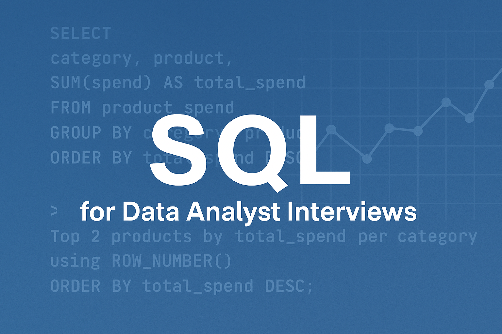

# SQL-for-Data-Analyst-Interviews(Practice-Project)

  

This project documents my journey solving 30+ real-world SQL problems from platforms like DataLemur and StrataScratch, based on actual interview questions from companies like Amazon, Airbnb, and Spotify.  
📌 Goal: Prepare for data analyst interviews and build a portfolio of reusable SQL snippets for common business analysis scenarios.

🧠 Skills Practiced
QL Aggregation: GROUP BY, SUM, COUNT

Ranking & TopN logic: ROW_NUMBER(), RANK() with PARTITION BY

Time-based filters and trends: LAG(), DATEDIFF()

Subqueries, CTEs, Window Functions

Business KPIs: revenue, retention, active user classification, funnel conversion

## 📂 Problem Log

| # | Title                       | Description                                        | SQL File |
|---|-----------------------------|----------------------------------------------------|----------|
| 1 | Highest Grossing Products  | Top 2 products by total spend in each category     | [View SQL](solutions/01_highest_grossing_products.sql) |
| 2 | Most Profitable Company    | Coming soon...                                     | -        |
| 3 | Card Launch Success        | Coming soon...                                     | -        |
| 4 | Top States by Customers    | Coming soon...                                     | -        |
| 5 | Rolling Tweet Avg          | Coming soon...                                     | -        |

